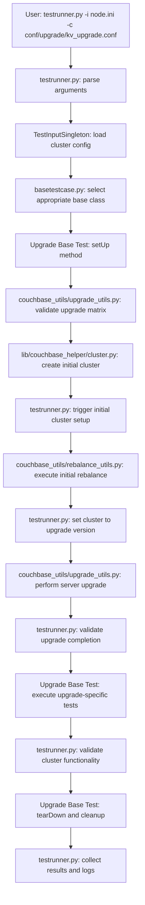
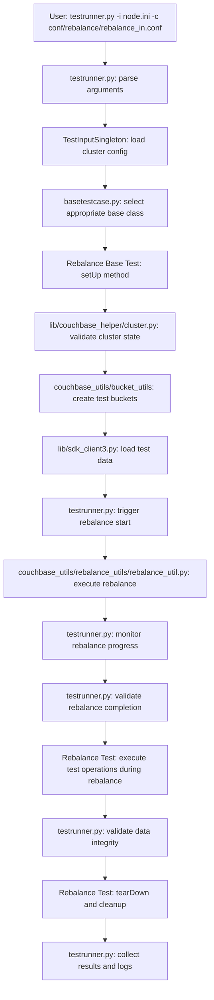
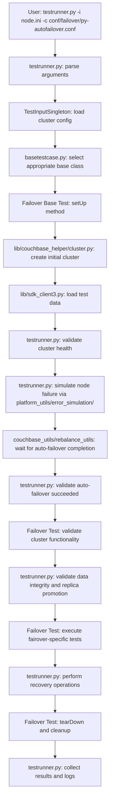

# TAF Architecture (Agent-Optimized)

## Module Boundaries and Ownership

### Test Implementation Layer (pytests/)
**Ownership:** All test code MUST live here. Never modify submodules.
**Purpose:** Test implementations organized by component/domain.

**Key Entry Points:**
- `pytests/basetestcase.py` – Base test class factory using `runtype` parameter
  - `runtype="default"` → `OnPremBaseTest`
  - `runtype="dedicated"` → `ProvisionedBaseTestCase`
  - `runtype="serverless"` → `OnCloudBaseTest`
  - `runtype="columnar"` → `ColumnarBaseTest`
- Test modules: `epengine/`, `cbas/`, `security/`, `storage/`, `upgrade/`, `Capella/`, `Atomicity/`, etc.

**Runtime Flow:**
1. `testrunner.py` parses command-line arguments
2. `TestInputSingleton` loads cluster configuration from `.ini` file
3. Base test case selected based on `runtype` parameter
4. Tests run with configuration from `.conf` files

### Core Framework Layer (lib/)
**Purpose:** Shared libraries and utilities used across all tests.

**Key Components:**
- `lib/sdk_client3.py` – Python SDK operations wrapper (72KB, heavily used)
- `lib/framework_lib/` – Test runner logic, command-line parsing, test configuration
- `lib/couchbase_helper/` – Cluster operations, document generation, query helpers
- `lib/BucketLib/` – Bucket operations (creation, deletion, configuration)
- `lib/CbasLib/` – Columnar/Analytics operations
- `lib/SecurityLib/` – Security utilities (TLS, encryption, X.509)
- `lib/SystemEventLogLib/` – Event log validation and simulation
- `lib/Jython_tasks/` – Jython task execution framework
- `lib/memcached/` – Memcached protocol clients (binary/ASCII)
- `lib/backup_service_client/` – Backup service API wrapper

**External Dependencies:**
- `lib/capellaAPI/` – Capella REST API libraries (SUBMODULE - DO NOT MODIFY)
- `lib/capellaAPI/CapellaRESTAPIs/` – Capella REST API v4 (SUBMODULE - DO NOT MODIFY)

### Feature-Specific Utilities (couchbase_utils/)
**Purpose:** Utilities organized by Couchbase Server feature/component.

**Key Utilities:**
- `couchbase_utils/cb_server_rest_util/` – Direct Couchbase REST API mappings
  - Organized by feature: `cluster_nodes/`, `buckets/`, `index/`, `query/`, `fts/`, `xdcr/`, etc.
- `couchbase_utils/security_utils/` – Security operations (TLS setup, X.509 certificates, encryption)
- `couchbase_utils/bucket_utils/` – Bucket management helpers
- `couchbase_utils/cluster_utils/` – Cluster operations helpers
- `couchbase_utils/upgrade_utils/` – Upgrade logic and matrix validation
- `couchbase_utils/rebalance_utils/` – Rebalancing helpers
- `couchbase_utils/dcp_utils/` – DCP protocol utilities

### Infrastructure Layer (platform_utils/)
**Purpose:** Low-level infrastructure utilities for SSH, Docker, simulation.

**Key Components:**
- `platform_utils/ssh_util/` – Paramiko-based SSH session management
  - `shell_util/` – SSH shell connection handling
  - `install_util/` – Install/uninstall utilities across platforms
  - `node_infra_helper/` – Remote node management
- `platform_utils/error_simulation/` – Network/disk error simulation
- `platform_utils/docker_utils/` – Docker operations

### Configuration Layer (conf/)
**Purpose:** Test suite selections and cluster topology.

**File Types:**
- `.ini files` – Cluster topology, node IPs, credentials, service configuration
- `.conf files` – Test module selections with parameters
  - Format: `module.class.test_method,param1=value1,param2=value2`
- Pattern: `conf/<component>/<test_suite>.conf`

### Constants Layer (py_constants/, constants/)
**Purpose:** Test constants and version mappings.

**Key Files:**
- `py_constants/cb_constants/CBServer.py` – Couchbase Server version mappings
- `py_constants/cb_constants/system_event_log.py` – Event log JSON schemas
- `constants/platform_constants/` – Platform-specific values
- `constants/cloud_constants/` – Cloud provider data

## Data Contracts and External Systems

### Couchbase Server Cluster
**Connection Method:** REST API (`127.0.0.1:8091` by default) + Memcached protocol
**Configuration Source:** `.ini` files (node IPs, credentials, services)
**Data Access:**
- REST API via `couchbase_utils/cb_server_rest_util/`
- Python SDK via `lib/sdk_client3.py`
- Memcached protocol via `lib/memcached/`

### Capella Integration
**Connection Method:** REST API v4 via `lib/capellaAPI/`
**Credentials:** Capella API keys, project IDs
**Test Location:** `pytests/Capella/` (REST API v4 tests)

### External Services
- **AWS:** `lib/awsLib/` (S3 operations via boto3)
- **Azure:** `lib/azureLib/` (Blob storage)
- **Kafka:** `couchbase_utils/kafka_util/` (Confluent/Molo17 integration)

## Document Loading Architecture

### Loading Methods
1. **default_loader** – Built-in Python SDK (default, no additional flags)
   - Uses `lib/sdk_client3.py` directly
   - No external process required

2. **sirius_java_sdk** – Sirius Java SDK via DocLoader
   - Requires `--launch_java_doc_loader` flag
   - Requires `--sirius_url <url>` parameter
   - DocLoader URL: `http://localhost:8080` by default

3. **sirius_go_sdk** – Sirius Go SDK via sirius submodule
   - Requires `--launch_sirius_process` or `--launch_sirius_docker`
   - Requires `--sirius_url <url>` parameter

### Submodule Architecture
**CRITICAL: DO NOT MODIFY THESE DIRECTORIES**
- `DocLoader/` – Java-based REST document loader (submodule)
- `lib/capellaAPI/` – Capella REST API libraries (submodule)
- `sirius/` – Go-based document client framework (submodule)

## Validation Clues by Layer

### Test Layer Validation
**Which tests exercise which components:**
- `epengine/` → KV/Data Service, Magma storage, durability
- `cbas/` → Analytics Service, external datasets, linking
- `security/` → TLS, encryption, RBAC, LDAP, SSO
- `storage/magma/` → Magma storage engine, compaction, DGM
- `upgrade/` → Upgrade matrix, version compatibility
- `Capella/` → Capella REST API v4 endpoints

### Library Usage Patterns
**SDK Client** (`lib/sdk_client3.py`):
- Used by all tests for CRUD operations
- Parameters: `num_items`, `document_size`, `expiry`, etc.

**REST API** (`couchbase_utils/cb_server_rest_util/`):
- Used for cluster management, bucket operations
- Feature-specific utilities (`cluster_nodes/`, `buckets/`, etc.)

**Helper Usage:**
```
Document Generation: `lib/couchbase_helper/document_generator.py`
Cluster Operations: `lib/couchbase_helper/cluster.py`
Query Helpers: `lib/couchbase_helper/query_helper.py`
```

## Common Traps for Future Agents

### 1. Submodule Modification
**Trap:** Accidently modifying submodule code
**Prevention:** NEVER modify `DocLoader/`, `lib/capellaAPI/`, `sirius/`
**Validation:** Check if directory is git submodule before editing

### 2. Hard-coded Credentials
**Trap:** Hard-coding cluster IPs, API keys, or secrets
**Prevention:** Always use `.ini` files or environment variables
**Validation:** Check for hard-coded values before creating tests

### 3. Wrong Test Base Class
**Trap:** Using wrong base test class for component
**Prevention:** Check `runtype` parameter and match to correct base class
**Validation:** Verify base class imports match component directory

### 4. Parameter Misconfiguration
**Trap:** Missing or incorrect test parameters
**Prevention:** Always check `TestInputSingleton.input.param()` usage
**Validation:** Verify required parameters are passed via `.conf` or command line

### 5. Document Loading Confusion
**Trap:** Using wrong document loading method
**Prevention:** Match `load_docs_using` parameter with appropriate flags
**Validation:** Check if `--launch_*` flags match loading method

### 6. Storage Engine Tests on Wrong Type
**Trap:** Running Magma tests on Couchstore buckets
**Prevention:** Check bucket configuration matches storage engine type
**Validation:** Verify test setup creates correct storage engine

### 7. Missing Cluster Reset
**Trap:** Cluster state pollution between tests
**Prevention:** Default is `skip_cluster_reset=False`, explicitly override
**Validation:** Check test requirements vs. cluster reset settings

### 8. Wrong Service Configuration
**Trap:** Tests expecting services not configured in cluster
**Prevention:** Check `.ini` file service configuration
**Validation:** Verify required services are enabled on test nodes

## Runtime Flow Diagram

```
User Command: testrunner.py -i node.ini -c conf/ep_engine/basic_ops.conf
      ↓
testrunner.py parses arguments
      ↓
TestInputSingleton loads node.ini (cluster topology)
      ↓
testrunner.py parses conf file (test selection)
      ↓
basetestcase.py selects base class based on runtype
      ↓
Test execution begins:
  - Cluster setup via lib/couchbase_helper/cluster.py
  - Document loading via configured method
  - Test method execution
      ↓
Results collected and logged to logs/testrunner-<timestamp>/
```

## Key Dependencies and Imports

**Critical Import Paths:**
```python
sys.path = [".", "lib", "pytests", "pysystests", "couchbase_utils",
            "platform_utils", "platform_utils/ssh_util",
            "connections", "constants", "py_constants"]
```

**Essential Imports:**
```python
from TestInput import TestInputSingleton  # Global parameter access
from sdk_client3 import SDKClient  # Python SDK operations
from couchbase_utils(cb_server_rest_util) import *  # REST API
from couchbase_utils(bucket_utils) import *  # Bucket helpers
```

## Test Configuration Data Flow

**.ini File Structure:**
```ini
[global]
username:root              # SSH user
password:couchbase           # SSH password
port:8091                # REST API port

[membase]
rest_username:Administrator  # Couchbase admin
rest_password:password       # Couchbase pass

[servers]
1:_1
2:_2

[_1]
ip:172.23.104.194        # Node IP
services:kv,index,n1ql      # Services on node
```

**.conf File Structure:**
```conf
module.class.test_method,param1=value1,param2=value2
module.class.test_method,param1=value1
```

**Parameter Access Pattern:**
```python
TestInputSingleton.input.test_params['get-cbcollect-info'] = True
TestInputSingleton.input.param("num_items", 100000)  # 100000 default
```

## Component-Specific Runtime Flows

### Upgrade Test Runtime Flow


**Upgrade Test Components:**
- `pytests/upgrade/` – Upgrade-specific test implementations
- `pytests/upgrade/kv_upgrade.py` – Core KV upgrade test logic
- `couchbase_utils/upgrade_utils/upgrade_util.py` – Upgrade matrix validation
- `couchbase_utils/upgrade_utils/upgrade_lib/couchbase.py` – Upgrade operations
- `couchbase_utils/rebalance_utils/rebalance_util.py` – Post-upgrade rebalance

**Upgrade Test Parameter Dependencies:**
```python
TestInputSingleton.input.param("initial_version", "7.6.0")
TestInputSingleton.input.param("target_version", "7.6.2")
TestInputSingleton.input.param("skip_cluster_reset", False)
TestInputSingleton.input.param("skip_cluster_cleanup", False)
```

### Rebalance Test Runtime Flow


**Rebalance Test Components:**
- `pytests/rebalance_new/` – Rebalance-specific test implementations
- `pytests/rebalance_new/rebalance_base.py` – Core rebalance test logic
- `couchbase_utils/rebalance_utils/rebalance_util.py` – Rebalance orchestration
- `couchbase_utils/bucket_utils` – Bucker management during rebalance
- `platform_utils/error_simulation/` – Network/failure simulation during rebalance

**Rebalance Test Parameter Dependencies:**
```python
TestInputSingleton.input.param("nodes_in", 2)
TestInputSingleton.input.param("replicas", 1)
TestInputSingleton.input.param("num_items", 100000)
TestInputSingleton.input.param("rebalance_ops", True)
TestInputSingleton.input.param("during_rebalance_operations", True)
```

### Failover Test Runtime Flow


**Failover Test Components:**
- `pytests/failover/failovertests.py` – Core failover test logic
- `pytests/failover/AutoFailoverBaseTest.py` – Auto-failover base class
- `pytests/failover/MultiNodeAutoFailoverTests.py` – Multi-node failover scenarios
- `platform_utils/error_simulation` – Network/dailure simulation
- `couchbase_utils/cluster_utils` – Cluster health monitoring
- `lib/SystemEventLogLib/ns_server_events.py` – Validate failover events

**Failover Test Parameter Dependencies:**
```python
TestInputSingleton.input.param("num_failed_nodes", 1)
TestInputSingleton.input.param("replicas", 1)
TestInputSingleton.input.param("num_items", 100000)
TestInputSingleton.input.param("use_https", False)
TestInputSingleton.input.param("enforce_tls", False)
TestInputSingleton.input.param("withMutationOps", False)
```
