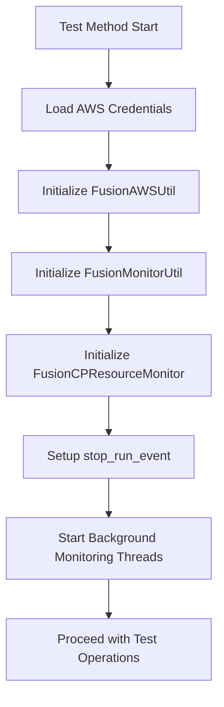
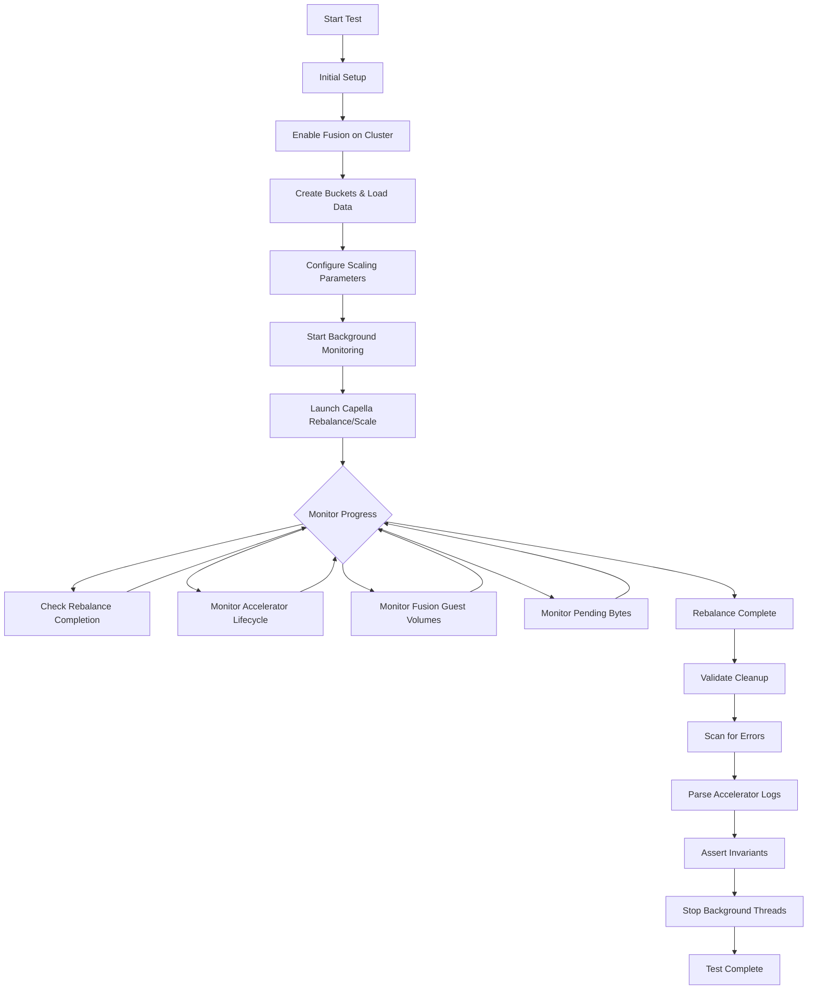
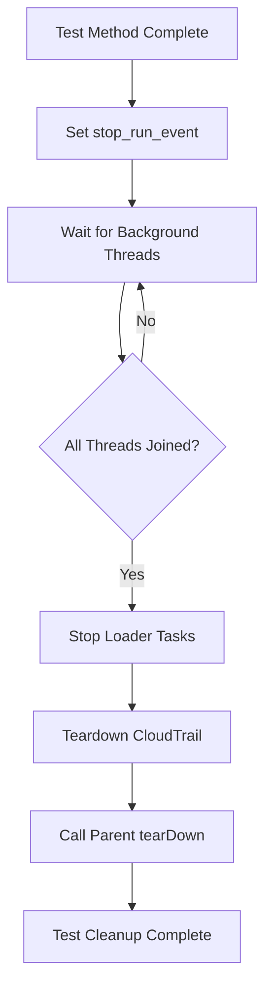

# Fusion Cloud Testing Architecture

This document describes the architecture for fusion cloud testing infrastructure in TAF (Test Automation Framework). The fusion cloud tests validate Couchbase serverless fusion functionality across AWS control plane resources and cluster-level operations.

## Overview

The fusion cloud testing code is organized into a clean 3-layer architecture with clear separation of concerns:

- **Layer 1**: AWS client wrappers (boto3 abstractions)
- **Layer 2**: Fusion-specific business logic and monitoring utilities
- **Layer 3**: Test orchestration and validation

This architecture promotes code reusability, maintainability, and eliminates duplication across different fusion test scenarios.

## Layer 1: AWS Libraries (awslib/)

Low-level AWS client wrappers providing clean abstractions for AWS operations.

### EC2Lib (`awslib/ec2_lib.py`)
**Purpose**: EC2 instance and volume management

**Key Features**:
- Instance discovery with tag-based filtering
- SSM command execution on remote instances
- Volume management and lifecycle operations
- Instance polling with timeout and state monitoring
- Network operations (public/private IP resolution)

**Core Methods**:
- `list_instances(filters)` - Discover instances by tags
- `poll_instances_by_tag(tags, ...) ` - Wait for instances to reach target state
- `run_shell_command(instance_id, command)` - Execute commands via SSM
- `list_volumes_by_cluster_id(filters)` - Query EBS volumes by cluster metadata
- `get_ebs_volume_by_id(volume_id)` - Retrieve volume details including IOPS and size

### S3Lib (`awslib/s3_lib.py`)
**Purpose**: S3 bucket and object operations

**Key Features**:
- Bucket listing and management
- File operations (list, delete, size calculation)
- Log artifact retrieval from S3
- Storage class analysis

**Core Methods**:
- `list_files_in_bucket(bucket, prefix)` - List objects with optional path filtering
- `get_bucket_size(bucket)` - Calculate total storage usage
- `delete_file(bucket, key)` - Remove individual objects
- `search_files_by_name_pattern(bucket, pattern)` - Find objects by name patterns

### SecretsManagerLib (`awslib/secrets_manager_lib.py`)
**Purpose**: AWS Secrets Manager credential retrieval

**Key Features**:
- Secret discovery by name patterns or tags
- JSON secret automatic parsing
- Bulk secret retrieval for multiple clusters
- Version management for secret values

**Core Methods**:
- `get_secret_by_name(secret_name)` - Retrieve single secret
- `get_secrets_by_tags(tags)` - Bulk retrieval by metadata tags
- `search_secrets_by_name(pattern)` - Pattern-based secret discovery
- `list_secrets()` - Complete secret inventory with metadata

### FISLib (`awslib/fis_lib.py`)
**Purpose**: AWS Fault Injection Simulator for accelerator fallback testing

**Key Features**:
- Compute failure simulation (graceful instance stops)
- Architecture-aware testing (ARM vs x86 separation)
- Sequential failure experimentation
- Automatic recovery with state monitoring

**Core Methods**:
- `create_compute_failure_experiment(...)` - Define failure scenarios
- `start_experiment(template_id, ...)` - Execute fault injection
- `wait_for_experiment_completion(...)` - Monitor experiment execution
- `filter_instances_by_architecture(...)` - Instance categorization

## Layer 2: Fusion Business Utilities

High-level orchestration and monitoring utilities with fusion-specific logic.

### FusionAWSUtil (`fusion_aws_util.py`)
**Purpose**: AWS orchestration façade for fusion operations

**Responsibilities**:
- Unified access point for EC2, S3, and Secrets Manager
- Fusion accelerator instance discovery (16K IOPS filtering)
- Structured logging with PrettyTable formatting
- Cluster instance error scanning and log analysis
- Auto Scaling Group (ASG) discovery for fusion resources

**Key Methods**:
- `list_accelerator_instances(filters, log)` - Filter instances by fusion characteristics
- `list_cluster_fusion_asg(cluster_id)` - Discover accelerator ASGs
- `scan_logs_for_errors_on_cluster_instances(cluster_id)` - Error detection automation
- `list_instances(filters, log)` - Enriched instance listing with volume details

**Usage Pattern**:
```python
fusion_aws = FusionAWSUtil(access_key, secret_key, region)
accelerators = fusion_aws.list_accelerator_instances(
    filters=[{'Name': 'tag:couchbase-cloud-cluster-id', 'Values': ['cluster-123']}],
    log="Fusion Accelerator"
)
```

### FusionMonitorUtil (`fusion_monitor_util.py`)
**Purpose**: Cluster-level fusion observability via REST API and cbstats

**Responsibilities**:
- Fusion state monitoring (enabled/disabled transitions)
- S3 URI discovery for fusion log stores
- Pending bytes tracking across cluster nodes
- Uploader map distribution monitoring (vBucket assignment)
- DCP item tracking during operations
- Credential management for REST API access

**Key Methods**:
- `wait_for_fusion_status(cluster, state, timeout)` - State transition validation
- `get_fusion_s3_uri(cluster, bucket_name)` - Log store endpoint discovery
- `log_fusion_pending_bytes(tenant, clusters, find_master_func)` - Fusion lag monitoring
- `get_fusion_uploader_map(tenant, cluster, find_master_func)` - vBucket distribution analysis
- `run_cbstats_on_all_nodes(cluster, bucket, stat_key)` - Distributed stats collection

**Usage Pattern**:
```python
fusion_monitor = FusionMonitorUtil(logger, fusion_aws_util)
fusion_monitor.wait_for_fusion_status(cluster, state="enabled", timeout=1800)
s3_uri = fusion_monitor.get_fusion_s3_uri(cluster, bucket_name='my-bucket')
fusion_monitor.log_fusion_pending_bytes(tenant, clusters, find_master_func)
```

### FusionCPResourceMonitor (`fusion_cp_resource_monitor.py`)
**Purpose**: AWS control plane resource monitoring during fusion operations

**Responsibilities**:
- EBS guest volume lifecycle monitoring (creation → hydration → cleanup)
- Fusion accelerator instance creation and termination tracking
- ASG cleanup verification after operations
- Continuous background monitoring with event-driven coordination
- Cluster instance error scanning (core dumps, memcached CRITICAL errors)
- Accelerator log processing from S3 storage

**Key Methods**:
- `monitor_fusion_guest_volumes(tenant, cluster, rebalance_task, ...)` - Complete volume lifecycle tracking
- `monitor_cluster_accelerator_instances(cluster, rebalance_task, fusion_rebalances)` - Accelerator orchestration monitoring
- `check_ebs_guest_vol_deletion(tenant, cluster, stop_run_event, ...)` - Background cleanup verification
- `scan_memcached_logs_for_errors(clusters, steady_state_workload_sleep)` - Error detection automation
- `parse_accelerator_logs(clusters, fusion_rebalances, access_key, secret_key, region)` - Log artifact analysis
- `monitor_fusion_accelerator_nodes_killed_after_rebalance(cluster)` - Post-operation validation

**Usage Pattern**:
```python
cp_monitor = FusionCPResourceMonitor(logger, fusion_aws_util)
success = cp_monitor.monitor_fusion_guest_volumes(
    tenant, cluster, rebalance_task, fusion_monitor_util,
    fusion_rebalances, wait_for_hydration_complete=True, timeout=1800
)

# Background monitoring
stop_event = threading.Event()
cleanup_thread = threading.Thread(
    target=cp_monitor.check_ebs_guest_vol_deletion,
    kwargs={"tenant": tenant, "cluster": cluster, "stop_run_event": stop_event}
)
cleanup_thread.start()
```

## Layer 3: Test Orchestration

Test classes that coordinate fusion operations using business logic utilities.

### VolumeTest (`fusion_volume.py`)
**Purpose**: Fusion volume scaling test orchestration

**Responsibilities**:
- Initial setup: Fusion enablement, bucket creation, data loading
- Scale operations: Horizontal (node count) and vertical (disk/compute) scaling
- Monitoring coordination: Start/stop monitoring threads during operations
- Validation: Accelerator cleanup, EBS cleanup, error scanning, log parsing
- Resource management: Clean shutdown with proper thread coordination

**Key Workflows**:
- **Horizontal Scaling**: Add/remove nodes while monitoring accelerator lifecycle
- **Vertical Scaling**: Scale disk and compute independently and together
- **Volume Operations**: Monitor EBS guest volume creation, hydration, and cleanup
- **Error Detection**: Scan logs for CRITICAL errors during operations

**Architecture Benefits**:
- **Delegation Pattern**: Test logic delegates to specialized utility classes
- **Single Responsibility**: Test class focuses on orchestration, utilities handle monitoring
- **Code Reusability**: Utility classes used across different test scenarios
- **Thread Safety**: Event-driven coordination for clean lifecycle management

**Usage Pattern**:
```python
class TestFusionScaling(VolumeTest):
    def setUp(self):
        super(TestFusionScaling, self).setUp()
        self.fusion_aws_util = FusionAWSUtil(self.aws_access_key, self.aws_secret_key, region=self.aws_region)
        self.fusion_monitor = FusionMonitorUtil(self.log, self.fusion_aws_util)
        self.cp_monitor = FusionCPResourceMonitor(self.log, self.fusion_aws_util)
        self.stop_run_event = threading.Event()

    def test_volume_scaling_horizontal(self):
        self.initial_setup()
        self.num_nodes["data"] = 5
        self.fusion_rebalances = list()

        # Start background monitoring
        ebs_cleanup_thread = threading.Thread(
            target=self.cp_monitor.check_ebs_guest_vol_deletion,
            kwargs={"tenant": tenant, "cluster": cluster, "stop_run_event": self.stop_run_event}
        )
        ebs_cleanup_thread.start()

        # Perform rebalance with monitoring
        rebalance_task = self.task.async_rebalance_capella(self.pod, tenant, cluster, config, timeout=self.index_timeout)
        result = self.cp_monitor.monitor_fusion_guest_volumes(tenant, cluster, rebalance_task, self.fusion_monitor, self.fusion_rebalances)

        # Validation
        self.assertTrue(result, "Volume monitoring failed")
        self.scan_memcached_logs_for_errors()
        self.parse_accelerator_logs()

    def tearDown(self):
        self.stop_run_event.set()  # Signal threads to stop
        for thread in getattr(self, "background_threads", []):
            thread.join()
        super(TestFusionScaling, self).tearDown()
```

## Runtime Flows

### Initialization Flow


**Key Steps**:
1. Load AWS credentials from test parameters or environment variables
2. Instantiate `FusionAWSUtil` with credentials and region
3. Instantiate `FusionMonitorUtil` with logger and `FusionAWSUtil` dependency
4. Instantiate `FusionCPResourceMonitor` with logger and `FusionAWSUtil` dependency
5. Initialize `threading.Event()` for thread coordination
6. Start background monitoring threads that respect the stop event
7. Proceed with primary test operations (scaling, rebalance, etc.)

### Test Execution Flow


**Key Phases**:
1. **Setup Phase**: Fusion enablement, bucket creation, data loading
2. **Monitoring Phase**: Concurrent monitoring of multiple aspects
   - Rebalance completion status
   - Accelerator instance lifecycle
   - Fusion guest volume hydration
   - Pending bytes and uploader distribution
3. **Validation Phase**: Cleanup verification, error scanning, log parsing
4. **Teardown Phase**: Stop background threads, collect results

### Teardown Flow


**Key Steps**:
1. Set `stop_run_event.set()` to signal all monitoring threads to stop
2. Wait for all background monitoring threads to join (with timeout)
3. Stop any document loader tasks running in the cluster
4. Teardown CloudTrail logging if configured
5. Call parent class tearDown for standard cleanup
6. Test cleanup complete

## Threading and Events Model

### Event-Driven Thread Coordination Pattern
The canonical pattern for clean thread lifecycle management in fusion tests:

```python
# Setup
def setUp(self):
    self.stop_run_event = threading.Event()

# Start background monitoring
def start_background_monitoring(self):
    cleanup_thread = threading.Thread(
        target=self.cp_monitor.check_ebs_guest_vol_deletion,
        kwargs={"tenant": tenant, "cluster": cluster, "stop_run_event": self.stop_run_event}
    )
    cleanup_thread.start()

# Utility method respects stop event
def check_ebs_guest_vol_deletion(self, tenant, cluster, stop_run_event):
    while not stop_run_event.is_set():
        # Monitoring logic
        time.sleep(30)

# Clean shutdown
def tearDown(self):
    self.stop_run_event.set()
    for thread in self.background_threads:
        thread.join()
```

**Key Principles**:
- Use `threading.Event()` for thread coordination
- Pass stop event to all long-running monitoring methods
- Monitor methods must check `event.is_set()` and exit gracefully
- Join threads in tearDown with timeout handling
- Handle thread exceptions gracefully during shutdown

### Foreground vs Background Monitoring

**Foreground Monitoring Threads**:
- Started before operations
- Joined before assertions (blocking until complete)
- Used for critical validation that must complete before proceeding

**Background Continuous Monitoring**:
- Started in setUp or before operations
- Run throughout test execution
- Stopped in tearDown via stop event
- Used for ongoing resource tracking and error detection

## Key Invariants and Assertions

Fusion tests validate the following invariants:

### Resource Lifecycle Invariants
- **Fusion Accelerator Resources**: Appear/disappear as expected during scaling operations
- **EBS Guest Volumes**:
  - Created during rebalance/scale operations
  - Remain attached during hydration phase
  - Cleaned up after rebalance completion (N → 0 volumes)
  - Properly tagged with rebalance IDs for tracking

### Cluster Health Invariants
- **Cluster State**: Returns to `healthy` after operations complete
- **No Failed Operations**: No `deployment_failed`, `rebalance_failed`, or `scaleFailed` states
- **Fusion Status**: Fusion state remains `enabled` throughout operations

### Error Detection Invariants
- **No CRITICAL Errors**: No CRITICAL errors in memcached logs during operations
- **No Hydration Failures**: No accelerator hydration failures in logs
- **No Core Dumps**: No core dumps detected on cluster instances
- **Clean Shutdown**: All resources properly cleaned up after test completion

## Extensibility Guidelines

### How to Add a New Fusion Cloud Test

Follow these patterns to maintain consistency and leverage existing infrastructure:

**Step 1: Reuse Existing Utilities**
```python
# DON'T: Direct boto3 usage in test code
import boto3
ec2 = boto3.client('ec2')  # ❌ AVOID

# DO: Use FusionAWSUtil
self.fusion_aws_util = FusionAWSUtil(access_key, secret_key, region)
instances = self.fusion_aws_util.list_accelerator_instances(filters)  # ✅
```

**Step 2: Centralize Monitoring in Utility Classes**
```python
# DON'T: Write monitoring logic in test class
def custom_monitoring(self):
    while True:
        volumes = self.ec2.describe_volumes(...)  # ❌ AVOID
        time.sleep(30)

# DO: Add monitoring methods to utility classes
class FusionCPResourceMonitor:
    def monitor_custom_resource(self, cluster, stop_run_event):
        while not stop_run_event.is_set():
            volumes = self.fusion_aws_util.ec2.list_volumes(...)  # ✅
            time.sleep(30)

# Test class uses the utility
result = self.cp_monitor.monitor_custom_resource(cluster, self.stop_run_event)  # ✅
```

**Step 3: Use Event-Driven Stop for Long-Running Threads**
```python
# Pattern: Pass stop_event to all monitoring methods
def test_new_scenario(self):
    # Start monitoring with stop event
    monitor_thread = threading.Thread(
        target=self.cp_monitor.monitor_during_operation,
        kwargs={"cluster": cluster, "stop_run_event": self.stop_run_event}
    )
    monitor_thread.start()

    # Perform test operations
    self.perform_test_operation()

    # Clean shutdown
    self.stop_run_event.set()
    monitor_thread.join()
```

**Step 4: Return Booleans and Assert in Test Layer**
```python
# Utility class returns boolean
class FusionMonitorUtil:
    def verify_fusion_enabled(self, cluster):
        # Returns True if enabled, False otherwise
        status, content = FusionRestAPI(cluster.master).get_fusion_status()
        return content['state'] == 'enabled'

# Test class performs assertions
result = self.fusion_monitor.verify_fusion_enabled(cluster)
self.assertTrue(result, "Fusion should be enabled")  # ✅
```

**Step 5: Keep AWS Credentials Handling Consistent**
```python
# Pattern: Use same credential initialization across tests
def setUp(self):
    # Load credentials from parameters
    self.aws_access_key = self.input.param("aws_access_key", None)
    self.aws_secret_key = self.input.param("aws_secret_key", None)
    self.aws_region = self.input.param("region", "us-east-1")

    # Initialize utilities consistently
    self.fusion_aws_util = FusionAWSUtil(self.aws_access_key, self.aws_secret_key, region=self.aws_region)
    self.fusion_monitor = FusionMonitorUtil(self.log, self.fusion_aws_util)
    self.cp_monitor = FusionCPResourceMonitor(self.log, self.fusion_aws_util)
```

## Architecture Diagrams

### Layering Diagram
```mermaid
flowchart TB
    subgraph L3[Test Orchestration]
        TV[fusion_volume.py<br/>(VolumeTest)]
    end

    subgraph L2[Business Utilities]
        AWSU[FusionAWSUtil]
        FMU[FusionMonitorUtil<br/>(REST + cbstats)]
        CPM[FusionCPResourceMonitor<br/>(EBS/ASG/Accelerators)]
    end

    subgraph L1[AWS Libraries]
        EC2[awslib/EC2Lib]
        S3[awslib/S3Lib]
        SM[awslib/SecretsManagerLib]
        FIS[awslib/FISLib]
    end

    TV --> FMU
    TV --> CPM
    TV --> AWSU
    AWSU --> EC2
    AWSU --> S3
    AWSU --> SM
    CPM --> EC2
    CPM --> S3
    FMU --> AWSU
    CPM --> AWSU
    TV -. optional .-> FIS
```

### Typical Scaling Test Sequence
```mermaid
sequenceDiagram
    participant Test as fusion_volume.py
    participant Capella as Capella Rebalance Task
    participant CPM as FusionCPResourceMonitor
    participant FMU as FusionMonitorUtil
    participant AWS as FusionAWSUtil

    Test->>AWS: init (creds, region)
    Test->>FMU: init(logger, AWS)
    Test->>CPM: init(logger, AWS)
    Test->>Test: start stop_run_event + monitoring threads
    Test->>Capella: async_rebalance_capella(...)

    par Monitor resources
        CPM->>AWS: list accelerators / EBS vols
    and Monitor cluster stats
        FMU->>FMU: REST/cbstats pending bytes/uploader map
    and Wait completion
        Test->>Capella: wait_for_rebalances()
    end

    Test->>CPM: verify cleanup + parse logs
    Test->>Test: stop_run_event.set(); join threads
```

## Testing Integration

### Running Fusion Cloud Tests

The fusion cloud tests are executed via the TAF test runner:

```bash
# Basic execution
python testrunner.py -i node.ini -c conf/fusion_volume.conf \
    -p aws_access_key=$AWS_ACCESS_KEY_ID \
    -p aws_secret_key=$AWS_SECRET_ACCESS_KEY \
    -p region=us-east-1

# With specific test parameters
python testrunner.py -i node.ini -c conf/fusion_volume.conf \
    -p h_scaling=True \
    -p iterations=3 \
    -p steady_state_workload_sleep=1800
```

### AWS Credentials Setup

Configure AWS credentials before running tests:

```bash
# Option 1: Environment variables (recommended)
export AWS_ACCESS_KEY_ID=your-access-key
export AWS_SECRET_ACCESS_KEY=your-secret-key

# Option 2: Pass as test parameters
python testrunner.py ... -p aws_access_key=$AWS_ACCESS_KEY_ID -p aws_secret_key=$AWS_SECRET_ACCESS_KEY

# Option 3: AWS credentials file (~/.aws/credentials)
cat ~/.aws/credentials
[default]
aws_access_key_id = your-access-key
aws_secret_access_key = your-secret-key
```

## Performance Considerations

The architecture includes several performance optimizations:

- **Pagination**: AWS APIs use pagination for large result sets
- **Batch Operations**: S3 deletions and EC2 operations use batching where possible
- **Connection Pooling**: boto3 handles connection pooling automatically
- **Timeout Configuration**: All monitoring operations have configurable timeouts
- **Polling Intervals**: Configurable poll intervals to balance responsiveness vs resource usage

## Error Handling

All layers include comprehensive error handling:

- **Logging**: All operations logged with appropriate levels (INFO, WARNING, ERROR)
- **Boolean Returns**: Utility classes return boolean success indicators instead of exceptions
- **Exception Handling**: AWS API errors caught and logged with context
- **Graceful Failure**: Tests fail with meaningful error messages, not cryptic exceptions
- **Retry Logic**: Built-in retry for transient AWS API failures

## Related Documentation

- **README.md** - Quick start guide and test execution overview
- **FUSION-Agent.md** - Code quality guidelines and regression prevention strategies
- **FIS-LIB-README.md** - Comprehensive FIS library documentation
- **TAF Framework Documentation** - General TAF testing guidelines
- **AWS Documentation** - boto3 library reference and API documentation

## Support and Contributing

**For Questions**: Contact the fusion testing team or refer to internal team documentation.

**Contributing**: When adding new fusion utilities or tests, follow the established 3-layer architecture and patterns documented in this architecture guide. Key principles:

- Maintain clear separation of concerns between layers
- Prefer utility class methods over direct AWS API calls in tests
- Use event-driven thread coordination for background monitoring
- Return boolean indicators from utility classes, assert in test layer
- Keep credential handling consistent across all tests
